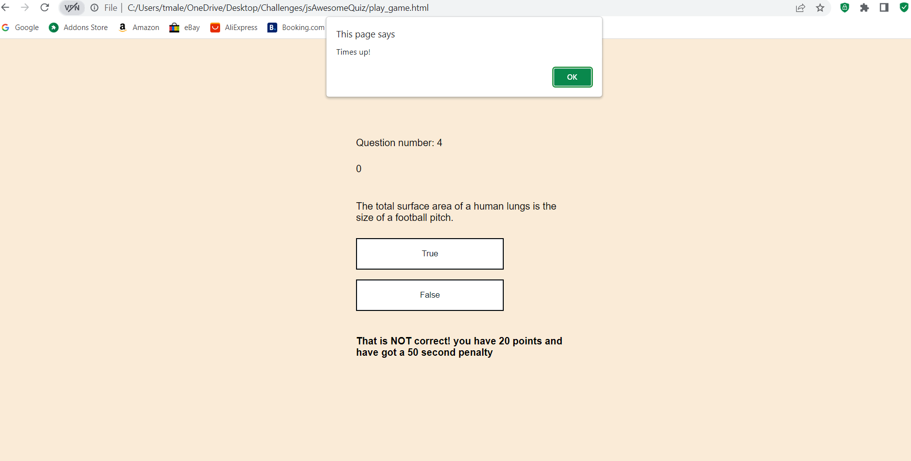

# jsAwesomeQuiz
## Description

This is a quiz app developed using Javascript, HTML and CSS. It is a timed quiz where the user has an alotted amount of time to to complete the quiz while the time is counting down.

## Installation

N/A

## Usage

- Upon opening the page you will see the landing page which welcomes the user and gives them instructions on how to use the app. 
- Once the start button is clicked the user is redirected to the page with the questions and the countdown begins! 
- The user can answer each question true or false
- For each correct answer the user gets 10 points added to their score.
- For each incorrect answer the user gets 50 seconds deducted from their time.  
- The user's score will be recorded as they play. When the user reaches the end of the game either by completing the questions or running out of time, they will receive a prompt
  which takes them to a page where they can store their score.  
- The user can save their score to local storage and will also have an option to go back to the home page. 

## Credits

- <a href="https://www.flaticon.com/free-stickers/profile" title="profile stickers">Profile stickers created by Stickers - Flaticon</a>

## License

Please refer to LICENSE in the repo
